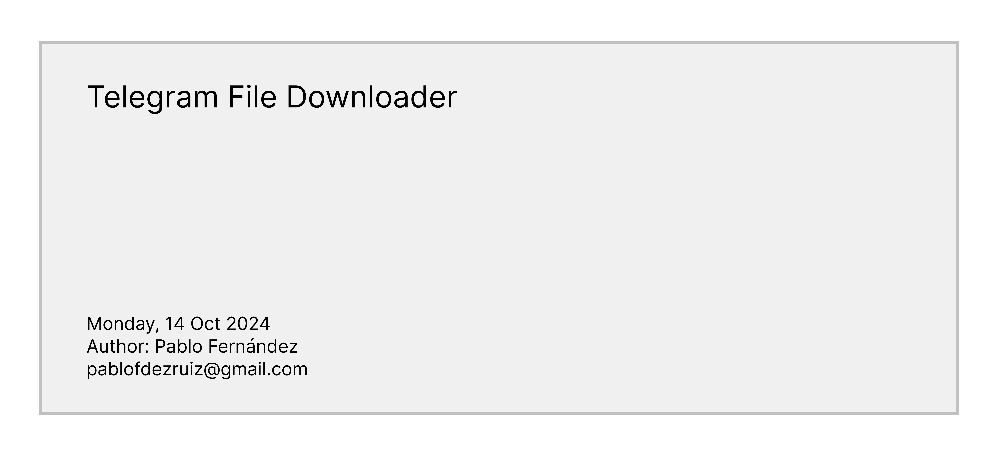

# Telegram File Downloader

## Overview

Telegram File Downloader is a robust Node.js application designed to download files and media from Telegram channels and chats using message links. It offers a user-friendly interface, supports concurrent downloads, provides real-time progress tracking, and efficiently handles large files.

## Features

- **Versatile Download Support**: Download files from both public and private Telegram channels, as well as public broadcast channels.
- **Concurrent Downloads**: Maximize efficiency with simultaneous downloads.
- **Real-time Progress Tracking**: Monitor download progress with live updates in the console.
- **Interactive User Interface**: Easy-to-use menu system for selecting input modes and managing downloads.
- **Download Management**: Pause, resume, and cancel functionality for active downloads.
- **Session Management**: Quick reconnection using saved sessions for subsequent runs.
- **Advanced Logging**: Detailed logging with daily rotation for easy troubleshooting.
- **Error Handling**: Graceful error management and recovery mechanisms.
- **Bulk Download Option**: Process multiple links from a text file.
- **Configurable Settings**: Customize application behavior through environment variables and a central configuration file.

## Prerequisites

Ensure you have the following before starting:

- Node.js (v14.0.0 or higher)
- npm (typically bundled with Node.js)
- A Telegram account
- Telegram API credentials (api_id and api_hash)

## Installation

1. Clone the repository:
   ```
   git clone https://github.com/pablofdezr/telegram-file-downloader.git
   cd telegram-file-downloader
   ```

2. Install dependencies:
   ```
   npm install
   ```

3. Set up your environment:
   Create a `.env` file in the root directory with the following content:
   ```
   API_ID=your_api_id
   API_HASH=your_api_hash
   LOG_LEVEL=info
   NODE_ENV=development
   ```
   Replace `your_api_id` and `your_api_hash` with your Telegram API credentials. You can obtain these at https://core.telegram.org/api/obtaining_api_id

## Configuration

The application uses a `config.js` file for centralized configuration management. Key settings include:

- `MAX_SIMULTANEOUS_DOWNLOADS`: Maximum number of concurrent downloads (default: 3)
- `MAX_RETRIES`: Maximum retry attempts for failed downloads (default: 3)
- `DOWNLOAD_TIMEOUT`: Download timeout in milliseconds (default: 300000)
- `LOG_LEVEL`: Logging verbosity (default: 'info')
- `DOWNLOADS_PATH`: Directory for downloaded files (default: user's Downloads folder)

You can override these settings by adding them to your `.env` file.

## Usage

1. Launch the application:
   ```
   npm start
   ```

2. First-time Setup:
   - Enter your phone number and the authentication code sent to your Telegram account.
   - For subsequent runs, you'll have the option to use the saved session.

3. Input Mode Selection:
   You'll be presented with an interactive menu to choose the input mode:
   - Use arrow keys to navigate
   - Press Enter to select:
     - "Manual input": Enter Telegram links individually
     - "File input": Provide a text file with multiple links

4. Entering Links:
   - For "Manual input", enter Telegram message links when prompted. Supported formats:
     ```
     https://t.me/c/channel_id/message_id  (for private channels)
     https://t.me/channel_name/message_id  (for public channels or broadcast channels)
     ```
   - For "File input", provide the path to a text file containing Telegram links (one per line).

5. Download Process:
   - The application will initiate the download(s).
   - Real-time progress updates will be displayed in the console.

6. Continuous Usage (Manual Mode):
   - To download another file, paste a new link when prompted.
   - To exit, type 'exit' at the link prompt.

## In-Progress Download Commands

While downloads are active, you can use these commands:

- `pause`: Temporarily halt all current downloads
- `resume`: Continue all paused downloads
- `status`: View the current status of all active downloads
- `cancel`: Terminate the current download

## Logging System

The application employs Winston for sophisticated logging:

- Logs are automatically rotated daily and stored in the configured `LOG_DIR`
- Separate files for general logs (`application-%DATE%.log`) and errors (`error-%DATE%.log`)
- Console output features color-coding for improved readability
- Log verbosity is configurable via the `LOG_LEVEL` environment variable

## Troubleshooting Guide

If you encounter issues:

1. Examine the log files in `LOG_DIR` for detailed error messages and application behavior.
2. Verify your Telegram API credentials in the `.env` file.
3. Ensure you have the necessary permissions to access the target channel/chat.
4. Confirm you're using a compatible Node.js version (v14.0.0+).
5. For connection problems, try adjusting `CONNECTION_RETRIES` and `CLIENT_TIMEOUT` in `config.js`.

## Contributing

We welcome contributions to the Telegram File Downloader! To contribute:

1. Fork the repository and create your branch from `main`.
2. Add tests for any new functionality.
3. Ensure your code passes all linting checks.
4. Update the documentation to reflect your changes.
5. Submit a pull request with a clear description of your improvements.

## License

This project is distributed under the MIT License. See the [LICENSE](LICENSE) file for full details.

## Disclaimer

This tool is intended for personal use only. Please adhere to Telegram's terms of service and respect copyright laws. Do not use this tool to download or distribute copyrighted material without proper authorization.